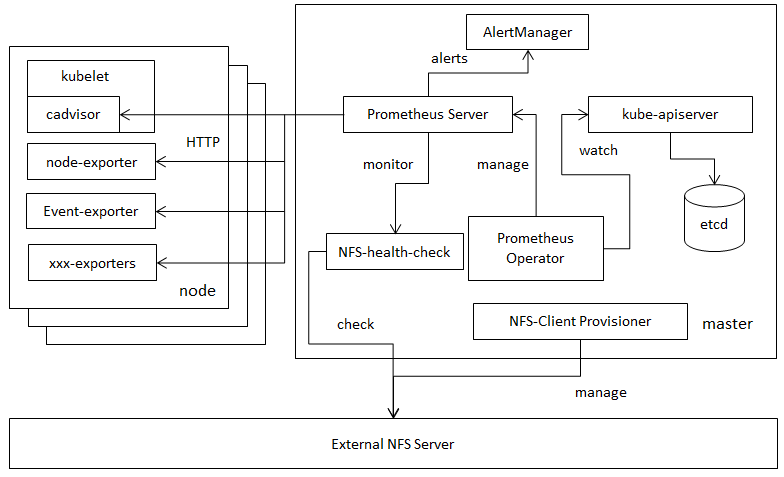

Externel NFS Storage Health Check
======

# Check Externel NFS

[Docker Pulls](https://hub.docker.com/r/aixeshunter/nfs-health-check/)

## NFS Storage, Prometheus and k8s cluster

### architecture




## How to check external NFS server?

Using Command `showmount -e ${NFS_SERVER_IP}` to check NFS server's health.

If the `showmount` command gets normally pod nfs-health-check are always `Running`, it will be 'Error' or 'CrashLoopBackup' status to the contrary.

>(showmount will return exit status when get error.)

Last, we can use prometheus rules to monitor nfs-health-check pod to get external NFS server status.

## Prometheus Rules

```yaml
- alert: NFSServerDown
annotations:
    summary: 'External NFS server is down!'
expr: |
    # get pod restart rate from 5m to check nfs server status
    rate(kube_pod_container_status_restarts_total{pod=~"(nfs-health-check).*"}[5m]) > 0
for: 5m
labels:
    severity: critical
```

## make images

```sh
make docker
```

## Compile

```sh
make build
``` 

## ENV

Using environment variables NFS_SERVER, NFS_PATH to point the external NFS server.

Like this in deploy.yaml
```yaml
containers:
- name: nfs-health-check
    image: aixeshunter/nfs-health-check:v1.1
    env:
    - name: NFS_SERVER
        value: 127.0.0.1
    - name: NFS_PATH
        value: /opt/nfs
```
